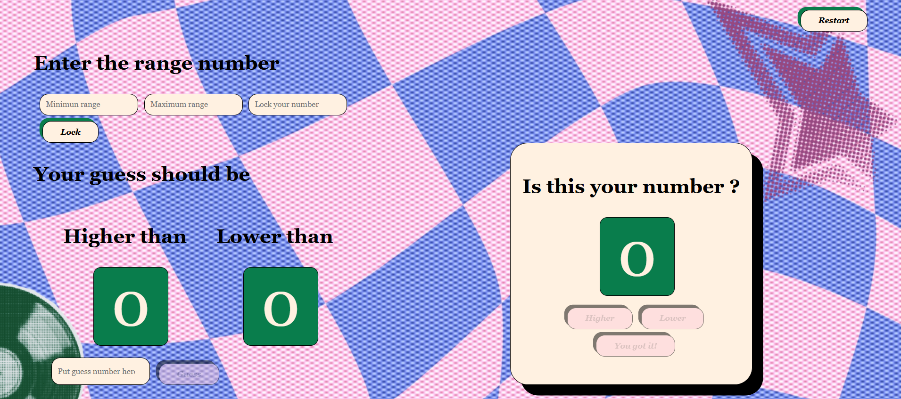

# Guess The Number Game
My second JS project after the word guessing game. This time, I build this all by my own and referencing my old project. This is a regular game to guess the bot's number before it guesses yours. Who founds it first wins.

## Hoested in GitHub Pages
Click the link https://amirqey.github.io/Guess-The-Number-Game/ 

# How to play
1. The system enforced the player to put the range numbers and lock their numbers.
2. Then the guess will be by turn, player gets to guess first. 
3. Then player need to click one of the three buttons to answer to the bot's guess.
4. This process repeats until one of them found their number.

# Architecture
- bp.py (python) --> the blueprint of the logics I need
- wireframe (canva)
- HTML, CSS, JS --> I split one html file to 3 files after finishing the code and comment it.

